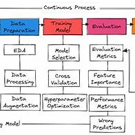

# 📘 Student Performance Prediction

This project analyzes the **Students Performance in Exams** dataset to understand how student test scores are influenced by various socio-demographic and educational factors. Using regression modeling and preprocessing pipelines, it aims to predict the **math score** based on other variables such as gender, ethnicity, parental education, lunch type, and test preparation course completion.

---

## 🔁 ML Lifecycle Overview

This diagram summarizes the ML workflow used in this project. Here's how each phase maps directly to the files/modules in the repo:

| **ML Lifecycle Stage**     | **What It Does**                                         | **Implemented In**                             |
|----------------------------|----------------------------------------------------------|------------------------------------------------|
| 🧹 Data Preparation        | EDA, cleaning, feature selection                         | `data_ingestion.py`, `data_transformation.py` |
| 🧠 Training Model          | Model selection, tuning, cross-validation                | `model_trainer.py`                            |
| 📊 Evaluation              | Metrics, comparison, error analysis                      | `model_trainer.py`, `utils.py`                |
| 🔁 Prediction Pipeline     | Reuse model + preprocessor for real-time predictions     | `predict_pipeline.py`                         |
| 🌐 Web Interface           | Collects user input, returns predictions                 | `app.py`, `templates/home.html`               |

---

## 📊 Dataset Overview

**Source:** [Kaggle - Students Performance in Exams]

**Features in the dataset:**
- `gender`: Male or Female
- `race/ethnicity`: Student group (A–E)
- `parental level of education`: Highest level of education completed by parents
- `lunch`: Standard or free/reduced lunch
- `test preparation course`: Completed or not
- `math score`: Target variable for this project
- `reading score` and `writing score`: Used as numerical predictors

---

## 🎯 Mission Statement

This project seeks to understand how **student performance**—measured by test scores—is affected by several key factors:
- Gender
- Ethnicity
- Parental level of education
- Lunch type
- Test preparation course completion

The goal is to **predict math scores** using a variety of machine learning regression models and to identify which features most influence academic success.

---

## 🛠️ Models Used

The following regression models were implemented and evaluated:

- 🌲 **Random Forest Regressor**
- 🌳 **Decision Tree Regressor**
- ⚡ **Gradient Boosting Regressor**
- 📈 **Linear Regression**
- 🦅 **XGBoost Regressor**
- 🐱 **CatBoost Regressor**
- 🔁 **AdaBoost Regressor**

All models underwent **hyperparameter tuning** using GridSearchCV to optimize performance.

---

## 🏆 Model Evaluation

The best-performing model achieved an **R² Score of `0.8804`**, indicating strong predictive performance.

### 📐 What is R² Score?
The **R² score** (coefficient of determination) is a statistical measure that explains how much of the variation in the dependent variable (math score) can be explained by the independent variables (gender, education level, etc.).

- **R² = 1** → Perfect prediction
- **R² = 0** → Model explains none of the variability
- **Our Score = 0.8804** → Model explains ~88% of the variability in student math scores

---

## 🔧 Technologies Used

- Python
- scikit-learn
- pandas
- numpy
- matplotlib / seaborn (for visualization)
- XGBoost, CatBoost
- Pipelines & ColumnTransformer
- Custom logging, exception handling

---

## 📌 Conclusion

By using a range of regression models and a clean ML pipeline architecture, we were able to build a reliable predictor of student math performance. The insights gained can help educators and policymakers tailor interventions to improve educational outcomes.

## 🙋‍♂️ Author

Chitransh Harshwal  

